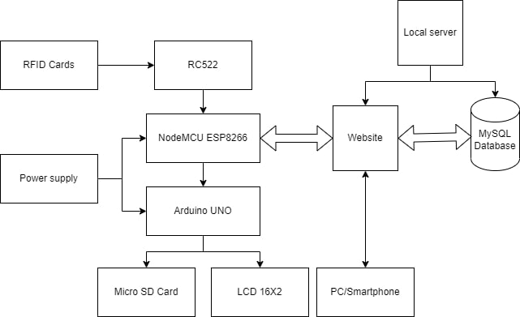
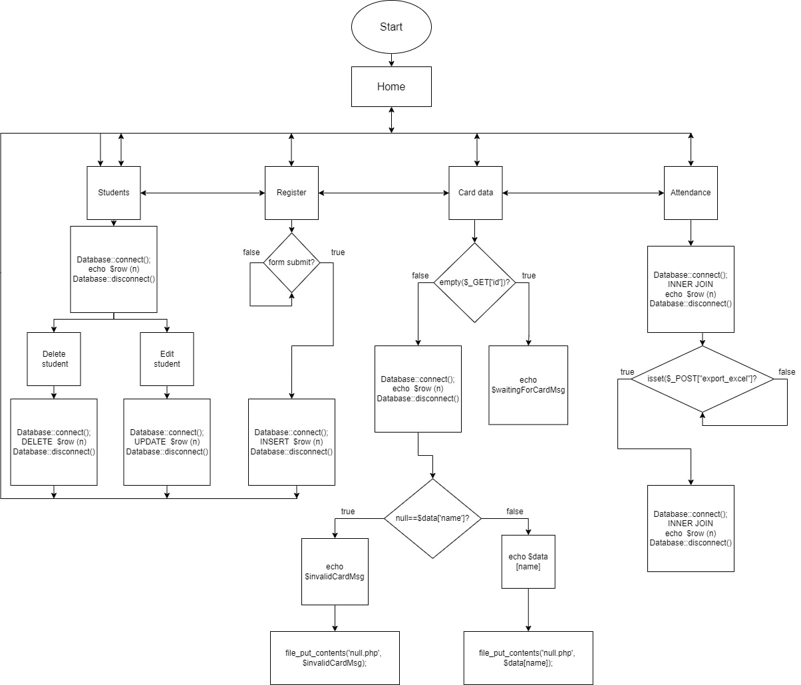
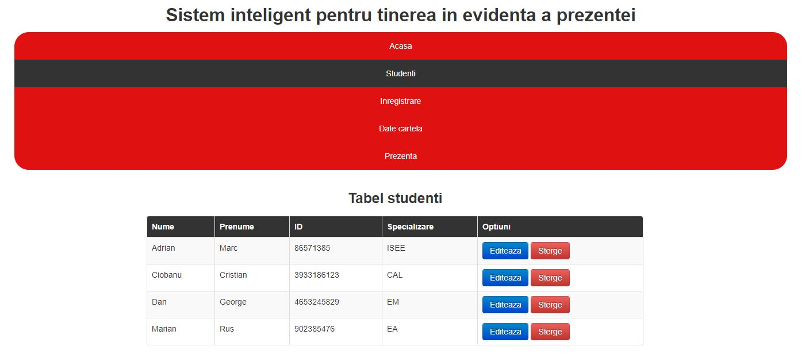
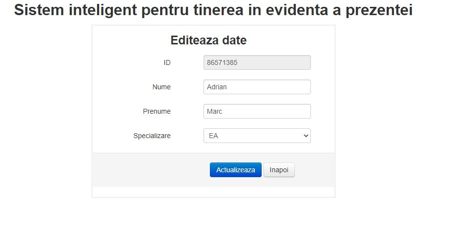
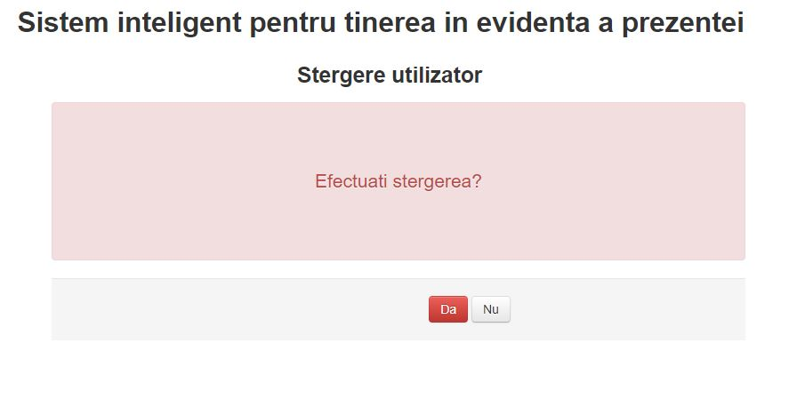
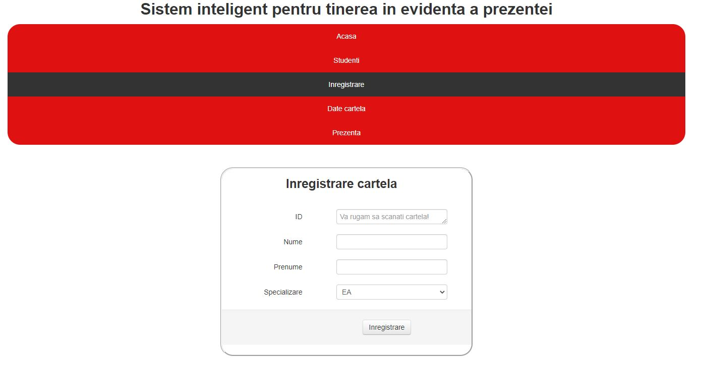
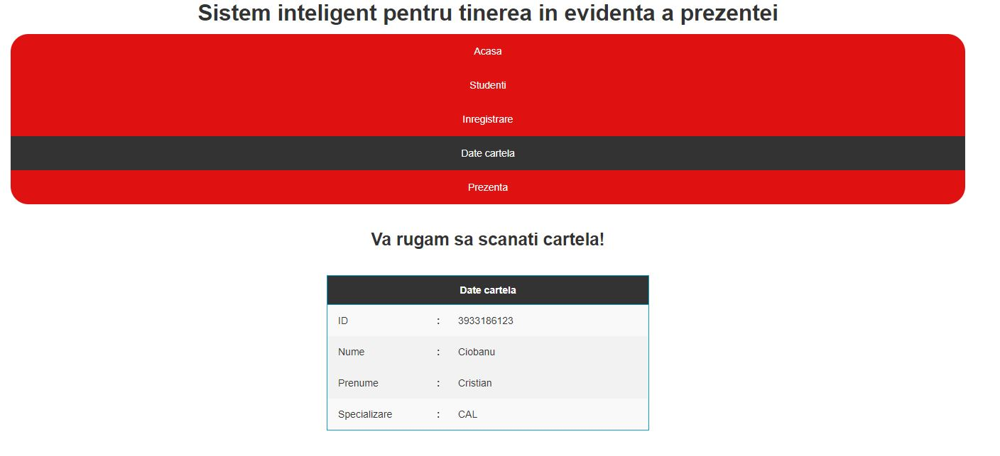
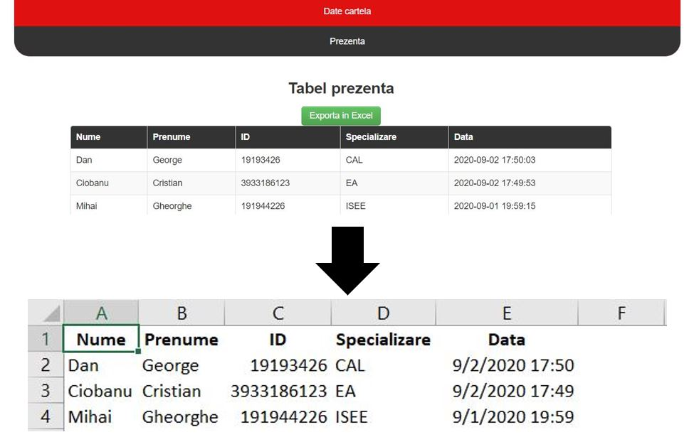

# PHP-NodeMCU-RFID-Attendance-logging-system

-Sistem ini didasarkan pada sebuah situs web yang dibuat dengan PHP, HTML, CSS, Bootstrap, Javascript, jQuery, sebuah papan NodeMCU, dan Arduino UNO (untuk perangkat keras), serta sebuah database MySQL.

-Perangkat keras akan membaca kartu RFID, menyimpan informasinya, dan mengirimkannya ke situs web yang akan memproses data tersebut kemudian memodifikasinya/menyimpannya dalam database SQL, lalu mengirimkan respons kepada perangkat sehingga dapat mencetak pesan pada layar LCD dan juga menulis hasilnya pada kartu micro SD.

-Situs web ini memungkinkan administrator untuk mendaftar, menghapus, dan bahkan mengedit pengguna dan kartu RFID yang terdaftar. Sistem ini menampilkan kehadiran terdaftar saat ini, dicatat pada halaman akhir dalam sebuah tabel yang diperoleh dengan menggabungkan inner 'users' dan 'logs' tabel, menggunakan queri MySQL. Tabel akhir ini juga dapat diekspor sebagai file Excel.

<h2>Project diagram</h2>

<h2>Website diagram</h2>

<h2>User data</h2>

<h2>User data edit page</h2>

<h2>User data delete page</h2>

<h2>Registration</h2>

<h2>Read tag</h2>

<h2>Attendance logs</h2>

<h2>Attendance logs exported as an Excel file</h2>

<h2>The logic behind the hardware device</h2>

<h2>The hardware device</h2>

